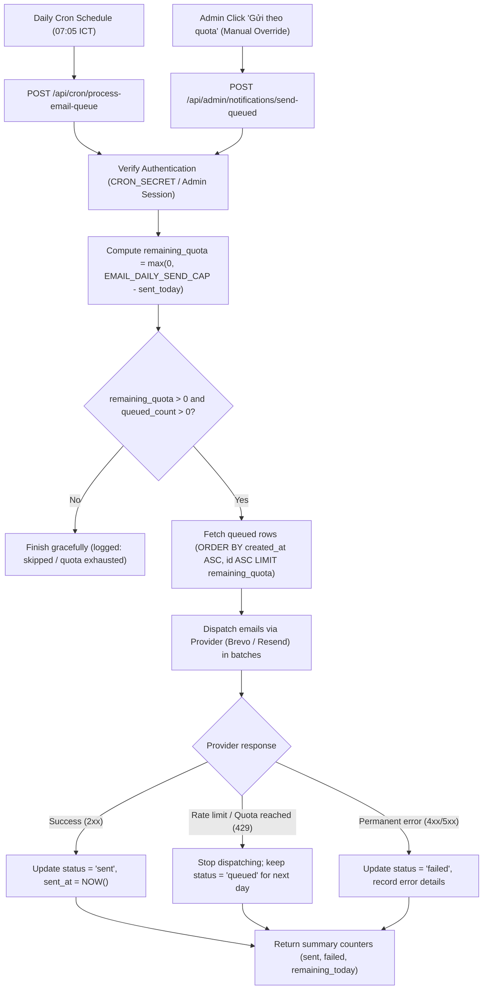

# Frontend architecture

The frontend uses a feature-based architecture. Route access is centralized, while each screen lives in the feature that owns its business role.

```text
src/
├── app/
│   └── AppRoutes.tsx          # Route table and route guards
├── auth/
│   └── access.ts              # Role predicates and access policy
├── features/
│   ├── student/pages/         # Student-only screens
│   ├── lecturer/pages/        # Lecturer-only screens
│   ├── admin/pages/           # Administration screens
│   └── shared/pages/          # Screens shared by multiple roles
├── shared/
│   └── index.tsx              # Reusable configuration, utilities and UI helpers
├── App.tsx                    # Authentication and application shell
└── main.tsx                   # Browser entry point
```

## Dependency rules

1. `App.tsx` owns authentication state and the global shell only.
2. `app/AppRoutes.tsx` is the only place that maps URLs to screens and role policies.
3. A role feature may import from `shared`, but it must not import a page from another role.
4. Shared multi-role screens belong in `features/shared`.
5. New screens should be added as one file under the appropriate `pages` directory and exported from that feature's `index.ts`.
6. Authorization must still be enforced by the API. Frontend route guards only control navigation and presentation.

## UI design system (Apple HIG Standard)

The entire application adheres to the **Apple Human Interface Guidelines (HIG)** design philosophy while preserving the signature FIT UET blue header gradient:

- **Comprehensive Design Specification**: Detailed guidelines live in [`docs/UI_DESIGN_SYSTEM.md`](docs/UI_DESIGN_SYSTEM.md).
- **Global Tokens**: Defined in `src/index.css` following Apple System Palette:
  - Canvas: Apple System Gray 6 (`#F5F5F7`).
  - Cards / Surfaces: Pure White (`#FFFFFF`) with 16 px squircle radius (`rounded-2xl`), hairline border (`rgba(0,0,0,0.08)` or `#E5E5EA`), and soft multi-layered ambient shadows.
  - Header: Preserved FIT UET gradient (`linear-gradient(110deg, #064889 0%, #075fc7 62%, #1473e6 100%)`).
  - Typography: San Francisco scale (`-apple-system, BlinkMacSystemFont, "SF Pro Display", "SF Pro Text", sans-serif`) with strict hierarchy from Large Title down to Caption.
- **Zero Redundancy**: Avoid repeating headers, duplicate badges, or redundant sub-toolbars on the same view.
- **Controls & Components**:
  - Buttons use 36-40 px height, 10-12 px squircle radius, and subtle active scale feedback (`active:scale-[0.98]`).
  - Tables use macOS Inset Table styling (subtle header, hairline horizontal dividers, smooth 120ms hover highlight).
  - Floating sheets and modal reviews use single-line headers, blurred backdrops (`backdrop-blur-md`), and edge-to-edge content viewers.
- **Reusable UI primitives**: Live in `src/shared/ui` and are exported through `src/shared/index.tsx`.

The backend remains compatible with both the Node server and Cloudflare Worker entry points; this refactor intentionally does not change API contracts or business behavior.

## Notification delivery flow

The manual notification composer supports two delivery modes:

- `website_and_email` — shown in the UI as **“Hiển thị trên website và gửi email theo quota”** and selected by default.
- `website_only` — shown in the UI as **“Chỉ hiển thị trên website”**.

For `website_and_email`, the backend first persists one notification for every valid recipient so website delivery does not depend on the email provider. It then calculates the remaining daily capacity as `EMAIL_DAILY_SEND_CAP - sent_today` and attempts immediate email delivery in creation order while capacity remains. Notifications beyond that capacity stay `queued` and are eligible for the existing queue processor on a later run or day.

Quota exhaustion is not an error: it must not reject the request or mark overflow notifications as `failed`. A provider rate-limit response also keeps an unsent notification in `queued`; other provider errors use `failed` with diagnostic details. The manual endpoint returns separate `created`, `sent`, `queued`, and `failed` counts so the admin UI can report the outcome accurately.

`EMAIL_BATCH_SIZE` only caps an explicit queue-processing run. `EMAIL_SEND_IMMEDIATE` continues to control automatic business-event notifications and does not disable quota-aware immediate delivery explicitly selected in the manual composer. The Node server and Cloudflare Worker must implement the same state transitions and quota rules.

### Automated Daily Queue Processing Architecture

To eliminate reliance on manual administrator intervention, the notification subsystem incorporates an **autonomous daily queue draining architecture**. Queued emails are automatically dispatched every day as soon as new quota becomes available, without requiring an Admin to log in and press the "Gửi theo quota" button.

#### 1. Core Architectural Shift: From Manual Trigger to Autonomous Scheduler

- **Previous Model (Manual Dependency):**
  When a batch notification exceeded the remaining quota for the day, excess notifications were held in `status = 'queued'`. To send these remaining emails on subsequent days, an administrator was required to remember to visit `/admin/notifications` and manually click **“Gửi theo quota”** or **“Gửi hàng đợi”**.
- **Autonomous Architecture (Zero-touch Daily Drain):**
  The system automates queue processing on a daily schedule. Each morning (at reset of the provider's daily counter), an automated scheduler triggers queue processing to drain up to the maximum remaining capacity for that day (`EMAIL_DAILY_SEND_CAP - sent_today`).

#### 2. Triggering & Scheduling Mechanisms

1. **Scheduled Daily Cron Runner:**
   - A scheduled GitHub Actions workflow (`.github/workflows/process-queued-emails.yml`) or Cloudflare Worker scheduled trigger executes daily at **00:05 UTC (07:05 AM ICT)**.
   - It issues an authenticated HTTP `POST` request to `/api/cron/process-email-queue` with the secret header `X-Cron-Secret: <CRON_SECRET>`.
2. **Server / Worker Cron Handler (`POST /api/cron/process-email-queue`):**
   - Validates `CRON_SECRET` to prevent unauthorized execution.
   - Invokes the shared queue draining routine (`sendQueuedNotificationBatch({ ignoreBatchSize: true })`) to consume up to the full remaining daily quota.
3. **Role of the Admin UI Button (“Gửi theo quota”):**
   - The manual button in the Admin dashboard remains active, but its role changes from a **mandatory operational requirement** to an **on-demand manual override**. Administrators may still trigger immediate batch sending if they want to force delivery ahead of the scheduled run.

#### 3. Execution Lifecycle & Invariants



#### 4. Design Invariants & Guarantees

- **No Over-Quota Sending:** The scheduler strictly respects `EMAIL_DAILY_SEND_CAP` (e.g. 250 for Brevo Free tier), ensuring external email provider daily limits (300/day) are never breached.
- **Strict FIFO Preservation:** Older queued notifications (`created_at ASC, id ASC`) are always prioritized and sent first.
- **Resilience to Restarts:** Queue state is persisted in the database (`status = 'queued'`); server restarts or deployment cycles never lose pending notifications.
- **Web Notification Independence:** All recipients always see the notification on the website immediately upon creation, irrespective of whether email delivery occurs immediately or across several days via the daily queue processor.

### Event Notification Recipient & Admin Exclusion Architecture

To protect both system resources and administrative workflows, the system enforces a strict separation between **push-based notifications** (individual transactional receipts sent to end users) and **pull-based monitoring** (centralized administration dashboards).

#### Recipient Routing Matrix

| Event Type | Intended Recipient | Admin Web Notification | Admin Email | Rationale / Delivery Mode |
| :--- | :--- | :---: | :---: | :--- |
| `registration_status_changed` | Student | ❌ No | ❌ No | Push to student regarding registration result |
| `final_confirmation_open` | Student | ❌ No | ❌ No | Push broadcast/targeted reminder to students |
| `final_internship_confirmed` | Student | ❌ No | ❌ No | Confirmation receipt for student |
| `advisor_assigned` | Student | ❌ No | ❌ No | Push assignment details to student |
| `final_report_due_reminder` | Student | ❌ No | ❌ No | Deadline reminder targeted to students |
| `final_report_status_changed` | Student | ❌ No | ❌ No | Review feedback pushed to student |
| **`grade_submitted`** | **Student Only** | ❌ **Excluded** | ❌ **Excluded** | **Push receipt strictly to the graded student. Admin excluded to prevent inbox flooding and quota exhaustion.** |

#### Design Rationale for Admin Exclusion on Grade Submission (`grade_submitted`)

1. **Inbox Spam Prevention (Tránh tràn hộp thư Quản trị):**
   - Each course run includes 600–900 students. When dozens of advisors evaluate students and submit grades across several grading days, pushing transactional notifications to `ADMIN_EMAIL` floods the admin inbox with hundreds of repetitive alert emails (e.g., `GVHD đã nộp điểm thực tập: <Mã SV> <Họ tên>`), drowning out critical operational correspondence.
2. **Quota Preservation (Bảo toàn hạn ngạch email nhà mạng):**
   - Transactional email providers often operate on tiered quotas (e.g., Brevo Free tier caps sending at 300 emails/day, with `EMAIL_DAILY_SEND_CAP=250`). Multiplying grade notifications by sending duplicate copies to Admin doubles email consumption and causes immediate quota exhaustion, preventing other students from receiving crucial notices.
3. **Pull-based Operational Paradigm (Quản lý tập trung qua Dashboard):**
   - Faculty and Admin manage and audit grade submissions via the dedicated Grade Management Dashboard (`/admin/grades`) and bulk Excel export (`/api/admin/grades/export`), equipped with real-time filters (by class, department, advisor, submission status). Push notifications for each single student grade submission provide no actionable value to Admin and violate clean notification domain boundaries.
4. **Backend Implementation Invariant:**
   - Both Express (`server.ts`) and Cloudflare Worker (`src/worker.ts`) handling of `POST /api/lecturer/grades/:userId/submit` must only dispatch `createNotification`/`notify` targeted to `recipient_email: student.email` and `recipient_user_id: student.id`. No notification record with `recipient_email = ADMIN_EMAIL` or Admin role shall ever be generated for `grade_submitted`.

## Unconfirmed Internship Students Export Architecture

### Business Purpose & Operational Context
During the internship campaign lifecycle, students submit up to 5 preferences for internship companies. After interviews are conducted, the Faculty opens the confirmation phase (`final_internships`) where each admitted student must attest and confirm one official location.

Administrators need to rapidly audit and extract the exact cohort of students who have registered on the system but **have not yet confirmed their official internship location**. This list enables the Faculty to:
1. Contact unconfirmed students via email/phone before deadlines expire.
2. Identify students who failed company interviews to transition them into school-based internships (`Trường Đại học Công nghệ`) with assigned faculty advisors.
3. Prepare final allocation reports for academic boards.

### UI Integration
- Located inside the **"Xuất dữ liệu"** dropdown on the primary Registration Admin screen (`/admin/registrations` / `AdminPanel.tsx`).
- Styled with an amber `UserX` icon and dual-line label:
  - Primary text: **Xuất DS chưa xác nhận (XLSX)**
  - Secondary helper text: **Sinh viên chưa xác nhận nơi thực tập**
- Features a loading spinner state (`RefreshCw`) during generation to prevent duplicate requests.

### Data Contract & Fields
The exported XLSX file (`danh_sach_sinh_vien_chua_xac_nhan_thuc_tap.xlsx`) includes:
- **STT**: Sequential number
- **Mã SV**: Student identification number
- **Họ và tên**: Full student name
- **Ngày sinh**: Date of birth
- **Lớp khóa học**: Academic cohort / class name
- **Mã học phần**: Internship course code
- **Số điện thoại**: Contact phone number
- **Email VNU**: Institutional email
- **Email cá nhân**: Alternate personal email
- **Số NV đã đăng ký**: Number of preferences registered
- **Các nơi đã đăng ký**: Concise summary of all registered companies with preference orders and approval statuses (e.g. `NV1: FPT Software (Đã duyệt); NV2: Viettel (Chờ duyệt)`)
- **Trạng thái xác nhận**: Fixed value `Chưa xác nhận`
- **Ghi chú**: Relevant registration notes

### Hybrid Execution & Resilience
1. **Primary Route**: Requests `GET /api/admin/unconfirmed-internships` (available in both Express `server.ts` and Cloudflare Worker `src/worker.ts`).
2. **Client-side Fallback**: If the server endpoint is momentarily unreachable (e.g. during a deployment restart), the client-side component automatically correlates the in-memory `registrations` state with `GET /api/admin/final-internships` to build and download the complete XLSX file seamlessly.


